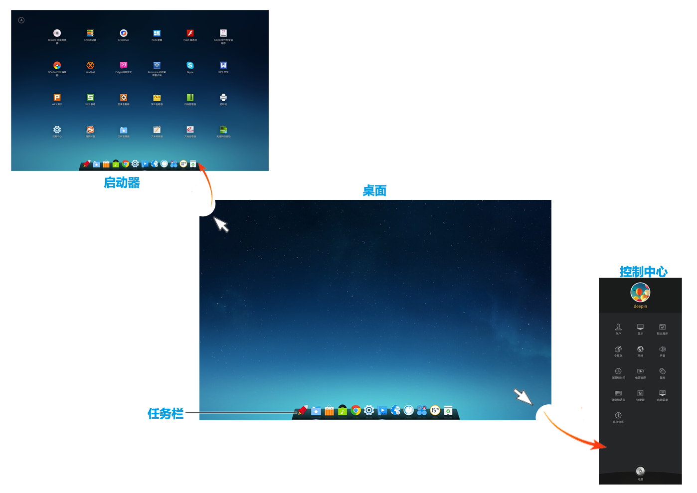
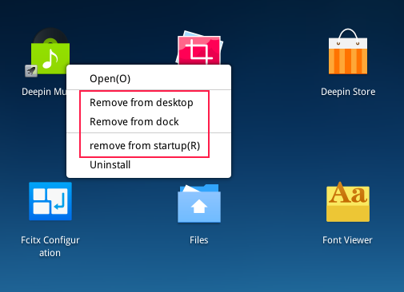
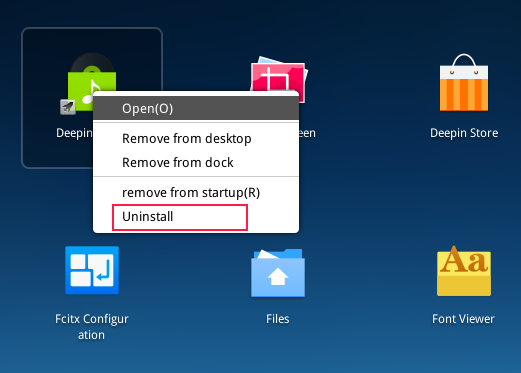
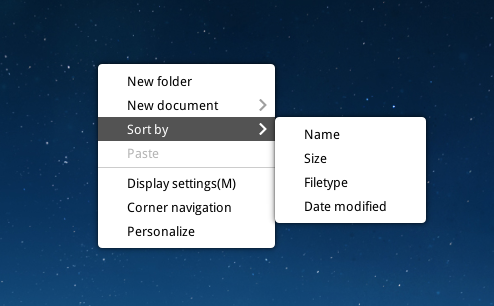
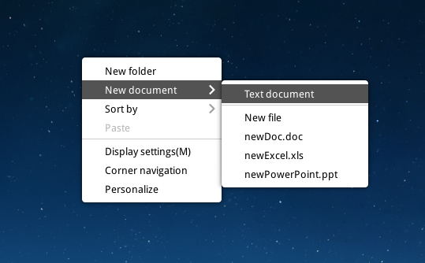

 # Deepin Operating System|../common/deepin-system.svg|
## Overview|../common/icon_overview.svg|

deepin 15.2 is the Linux desktop operating system released by Deepin Technology Co., Ltd. on May 2016. WPS Office, Sogou Input Method, Youdao Dic. and other deepin featured applications have been preinstalled in deepin. It allows you to experience a variety of recreational activities, but also to meet your daily needs. With continually improved and perfected functions, we believe deepin will be loved and used by more and more users.

## Guide|../common/icon_guide.svg|

### Open Launcher and Control Center
Corner navigation is set on four corners of the desktop by default, and you can quickly open Control Center and Launcher by it.

- Launcher can be opened by moving the mouse pointer over the upper left corner of the desktop. Click the mouse at any position to return to the desktop from launcher.

- Control Center can be opened by moving the mouse pointer over the lower right corner of the desktop. Click the mouse at any position outside the panel to exit.

> : You also can reset the corner navigation of Launcher and Control Center. Specific operations refer to [Corner Navigation](#Corner Navigation).

### Enter Shutdown Interface
In shutdown interface, you can select to shut down, restart, log out, lock and so on.

 

1. Move the mouse pointer over the lower right corner of the desktop to open Control Center.
2. Click on  at the bottom of Control Center to enter the shutdown interface.
3. If you want to exit the shutdown interface, please press  on keyboard or click on the blank area by mouse.

>  : You also can click on  on Dock to enter the shutdown interface.

### Boot and Shutdown
#### Boot
Turn on the computer to start your work now! Press the power button after plugging in to boot your computer.

#### Shutdown

1. Click on  at the bottom of Control Center.
2. Click on **Shutdown** or press  on keyboard.

### Log In
After booting, you need to create an account to log in before performing other operations.

 

1. On login interface, input the account password.
2. Press  on keyboard or click on .

> : The default account is the username and password set in the installation process. You can create a new account after logging in. Specific operations refer to [Create A New Account](dman:///dde-control-center#Create New Account).

You also can execute the following operations:

- If there are several accounts set in the computer, click on  in the lower right corner of login interface to switch user account. Specific operations refer to  [Switch User](#Switch User).

- If you want to shut down, restart or suspend, please click on  to enter shutdown interface, specific operations refer to [Enter Shutdown Interface](#Enter Shutdown Interface).

### Lock and Unlock Screen
Lock the screen to protect your account from being used by others.

 

#### Lock Screen
Sometimes you need to leave the seat for a while during the work, you can lock the screen before leaving the seat if you don't want data to be modified or seen. Others can use their own accounts to log in.

1. Click on  at the bottom of Control Center.
2. Click on **Lock**.

> : Press + on keyboard to quickly lock your screen.

#### Unlock Screen
You need to unlock screen after locked when reusing the computer.

1. On lock interface, input the account password.
2. Press  on keyboard or click on .

### Log Out
Clear the current account information by logging out. The computer will enter the login interface after logging out, then you can use another account to log in.

1. Click on  at the bottom of Control Center.
2. Click on **Log out**.

### Restart
Restart is to run you computer again after shutdown.

1. Click on  at the bottom of Control Center.
2. Click on **Restart**.

### Switch User
If there are several accounts in your computer, after logging out or locking the screen, you can use another account to log in.

1. Click on  at the bottom of Control Center.
2. Click on **Switch user** to view all accounts in your computer.
3. Select an account.
4. Input the account password.
5. Press  on keyboard or click on  to log in again.

 

### Suspend and Wake Up
#### Suspend
Suspend mode is an power-saving mode. Computer will automatically be suspended if there is no operations for a long time. After the computer being suspended, the entire system will be running with low consumption.

1. Click on  at the bottom of Control Center.
2. Click on **Suspend**.

#### Wake Up
Your computer will quickly restore to the previous working status after woke up.

If you want to restore to working status from suspend mode, you can:

* Move the mouse randomly.
* Press any key on keyboard.
* Quickly press the power button.

## Desktop Environment|../common/icon_desktopenvironment.svg|

 

### Dock
Dock is usually displayed at the bottom of the desktop to help you fix frequently used applications.

 

<table class="block1">
    <caption>Icon Description</caption>
    <tbody>
        <tr>
            <td></td>
            <td>Click to enter into launcher interface</td>
            <td class="blank"></td>
            <td></td>
            <td>Click to open Deepin Store</td>
        </tr>
        <tr>
            <td></td>
            <td>Click to open Deepin Movie</td>
            <td class="blank"></td>
            <td></td>
            <td>Click to open Deepin Music</td>
        </tr>
        <tr>
            <td></td>
            <td>Click to open webpages</td>
            <td class="blank"></td>
            <td></td>
            <td>Click to open control center panel</td>
        </tr>
        <tr>
            <td></td>
            <td>Click to open file manager</td>
            <td class="blank"></td>
            <td></td>
            <td>Click to open the interface of network settings</td>
        </tr>
        <tr>
            <td></td>
            <td>Click to open the interface of sound settings</td>
            <td class="blank"></td>
            <td></td>
            <td>To display the running applications</td>
        </tr>
        <tr>
            <td></td>
            <td>Click to quickly enter the shutdown interface</td>
            <td class="blank"></td>
            <td></td>
            <td>Click to open the date and time interface</td>
        </tr>
		<tr>
            <td></td>
            <td>Click to open the trash</td>
            <td class="blank"></td>
            <td>-</td>
            <td>-</td>
        </tr>
    </tbody>
</table>

### Launcher
Launcher helps you manage all applications installed in your system, and the needed applications can be found quickly by category navigation or searching function.

> : You can enter into launcher to view applications newly installed in the system. There will be a small blue dot prompt on the left of newly installed applications.

 

### Control Center
Control Center allows you to view and make basic system settings, including changing user account and setting screen display, etc.

 

### Window Manager
You can display different window contents in different workspaces and manage desktop windows in groups by window manager.

 

### Trash
You can find all deleted files in trash which can be resumed or emptied.

- Trash will be displayed on desktop if you switch to classic mode or efficient mode.
-  Trash will be displayed on Dock if you switch to fashion mode.

#### Restore Files
You can restore files deleted by mistake by executing the following operations:

1. Select file to restore in trash.
2. Click on **Restore**.

> : Restore is to restore the file in trash to its original directory. But it is unable to restore the files in trash if empty operation has been executed.

#### Empty Trash
Empty trash to release more usable space in your disk.

1. In trash, click on **Empty**.
2. Click on **Empty Trash**.

## Basic Operations|../common/icon_basicoperation.svg|
### Personalize Desktop
Desktop is the interface for human and computer to interact, and helps you to manage the applications.

 

You can select some elegant and fashionable wallpapers to beautify desktop and make it distinctive.

1. Right click on desktop.
2. Click on **Personalize** to open the interface of personalized settings.

> :  Specific operations of personalization refers to [Personalization](dman:///dde-control-center#Personalization).

###  Set Display
You can adjust the visual perception by setting the screen resolution, brightness and so on.

1. Right click on desktop.
2. Click on **Display settings** to open the interface of display settings.

> :  Specific operations of display refers to [Single Screen Settings](dman:///dde-control-center#Single Screen Settings)

### Corner Navigation
Corner navigation is to simplify your operations and helps you quickly enter the main interface.

 

#### View Hot Corners
You can right click to view the default corner navigation.

1. Right click on desktop.
2. Click on **Corner navigation**, then the whole screen will get dark and the corresponding hot corner function will be displayed on the four corners of the screen.
3. If you want to exit corner navigation, please click the mouse in the blank area of desktop.

#### Change Hot Corners
You can reset the hot corner function of four corners on the screen.

1. Right click on desktop.
2. Click on **Corner navigation**.
3. Move the mouse pointer on a corner of the desktop, and then select another one.

### Set Dock
#### Switch Display Mode
There are three display modes of Dock, which are fashion mode, efficient mode and classic mode.

- **Fashion mode**: The display mode is similar to Mac OS and displayed by a tray at the bottom of screen. All fixed application icons will be displayed on Dock.
- **Efficient mode**: The display mode is similar to Windows 7 and displayed by a small strip at the bottom of screen. Application icons fixed on Dock by default will be displayed in small ones, and icons of same types will be merged together to save more space for others.
- **Classic mode**: The display mode is similar to Windows XP and displayed by a small strip at the bottom of screen. Icons in same type will be displayed separately to quickly view and switch.

 
 
 
 
 

You can switch the display mode by the following operations:

1. On desktop, move the mouse pointer over Dock.
2. Right click.
3. Select a display mode.

 

#### Show/Hide Dock
You can hide the dock to extend the operational area on desktop furthest.

1. On desktop, move the mouse pointer over Dock.
2. You can right click to:

  - Select **Keep showing**, Dock will be displayed at the bottom of desktop all the time.
  - Select **Keep hidden**, Dock will be hidden and only displayed when mouse hovering on Dock.
  - Select **Smart hide**, Dock will be automatically hidden when Dock area needs to be used.

 

>: Press + on keyboard to quickly display/hide Dock.

#### Notification Area Settings
Notification area is used to display time, sound, network and so on.

- If Dock is displayed in fashion mode, the notification area will be displayed on Dock.
- If Dock is displayed in efficient mode or classic mode, the notification area will be displayed in the right side of Dock.

Some icons will be displayed in notification area by default, such as network and sound.

1. On desktop, move the mouse pointer over Dock.
2. Right click to select **Notification area settings*.
3. Click on the buttons of Network, Sound and so on to hide or display the application icons.

 

## Management of Applications|../common/icon_applicationmanagement.svg|
You can view all installed applications in launcher.

### Sort Applications

In Launcher, all applications will be displayed by name by default.

- Hover the mouse on the application icon, hold the left mouse button and drag the application icon to the specified position.
- Click the category icon at the upper left corner of launcher interface to sort icons by category.

1. In Launcher, move the mouse pointer over the application icon.
2. Click on  icon.
3. Display application icons by category.
4. Hover the mouse over "by category" to display the icons and texts. 

 
 
### Search Applications

In Launcher, scroll up and down the mouse wheel to find the application you need. And you also can find applications more quickly by category navigation.

If you already know the name of the application, you can locate it quickly by directly typing the key words in search box.

1. In Launcher, type the key word in the top search box of launcher, such "deepin".
2. System will automatically search for all applications which contain the keyword "deepin", and then display the searched result in Launcher.

 

### Set Shortcuts
Shortcut is an easy and convenient way to launch applications.

#### Create Shortcuts
You can choose to send the application to desktop or dock to facilitate follow-up operations.

1. In Launcher, move the mouse pointer over the application icon.
2. Right click the application icon, you can:
   - Click on **Send to desktop** to create a shortcut on desktop.
   - Click on **Send to dock** to fix the application on Dock.
   - Click on **Add to startup** to add the application to startup, it will automatically run when the computer boots.

 

>: By mouse you can drag the application icon from Launcher to Dock. But, you can not drag and drop the application while it is running. At this time you can right click the application icon on Dock and select **Dock** to fix. So that you can quickly open it on Dock.

#### Delete Shortcuts
You can delete the application shortcuts from desktop, Dock and so on.

1. In Launcher, move the mouse pointer over the application icon.
2. Right click the application icon, you can:
   - Click on **Remove from desktop** to delete the shortcut on desktop.
   - Click on **Remove from dock** to remove the application fixed on Dock.
   - Click on **Remove from startup** to remove the application from startup.

 

> : Application fixed on Dock can be removed by pressing and holding left mouse button to drag the application icon away from Dock.You can not drag and remove the application while it is running. At this time you can right click on the application icon on Dock and select **Undock** to remove.

### Run Applications
For those whose desktop shortcuts have been created or fixed on Dock, you can also open them by the following ways.

- Double click the desktop icon or right click the desktop icon to select **Open**.
-Click the application icon on Dock or right click to select **Run** .

You can open the application by the following steps if it's in the Launcher interface.

1. In Launcher, move the mouse pointer over the application icon.
2. Click the application icon or right click to select **Open** .

### Uninstall Applications
You can choose to uninstall applications you no longer use to save disk space.

1. In Launcher, right click the application icon.
2. Click on **Uninstall**.

 

> : In **Fashion mode**, press and hold the left mouse button in launcher and drag the application icon to  to remove.

## Management of Desktop Files|../common/icon_desktopfilemanagement.svg|

You can execute related operations on the files stored on desktop as needed.

### Sort Files

1. Right click on desktop.
2. Click on **Sort by**, you can:
  - Click on **Name** to display files in the order of their names.
  - Click on **Size** to display files in the order of their sizes.
  - Click on **Type** to display files in the order of their types.
  - Click on **Date modified** to sort display files in the order of their last modified date.

 

### Create New Files

1. Right click on desktop.
2. Click on **New document**.
3. Select type for the new file.
4. Input name for the new file.

 

### Create New Folders

1. Right click on desktop.
2. Click on **New folder**.
3. Input name for the new folder.

### Rename Files

1. On desktop, right click on the file.
2. Click on **Rename**.
3. Input a new name for the file.

### Copy/Cut Files

1. On desktop, right click on the file.
2. Click on **Copy** or **Cut**.
3. Select a target storage directory.
4. Right click to select **Paste**.

### Compress/Extract Files

1. On desktop, right click on the file.
2. Click on **Compress**.
3. Input name for the package, select the package type and target storage directory.
4. Click on **Create**.

 

Compressed files can be extracted to one or more files. To extract a file, you can:

1. On desktop, right click on the compressed file.
2. Click on **Extract Here**.
3. The compressed file is extracted to desktop.

> : You also can double click on the compressed file, click on **Extract** to select a target storage directory, and then click on **Extract**.

### View File Property

1. On desktop, right click on the file.
2. Click on **Properties** to view or change the basic information and permissions.

 

### Delete File

1. On desktop, right click on the file.
2. Click on **Delete**.

## Workspace Management|../common/icon_workspacemanagement.svg|
Workspace is to manage your desktop window in groups. Your workspace will be enlarged by dividing it.

### Shortcuts
A lot of shortcuts have already been set in window manager. You can complete operations relevant to the window and workspace by all sorts of shortcuts.

> : You can enter **Control Center** > **Keyboard Shortcuts** to view the shortcuts related to window manager.

<table class="block1">
    <tbody>
        <tr>
            <td>Display workspace</td>
            <td>Super + S</td>
        </tr>
       <tr>
            <td>Display windows of current workspace</td>
            <td>Super + W</td>
        <tr>
            <td>Display windows of all workspaces</td>
            <td>Super + A</td>
        </tr>
        <tr>
            <td>Switch windows</td>
            <td>Alt + Tab</td>
        </tr>
        <tr>
            <td>Switch windows in reverse</td>
            <td>Alt + Shift + Tab</td>
        </tr>
        <tr>
            <td>Switch similar windows</td>
            <td>Alt + ~</td>
        </tr>
         <tr>
            <td>Switch similar windows in reverse</td>
            <td>Alt + Shift + ~</td>
        </tr>
        <tr>
            <td>Zoom in screen display</td>
            <td>Super + =</td>
        </tr>
        <tr>
            <td>Zoom out screen display</td>
            <td>Super + -</td>
        </tr>
        <tr>
            <td>Zoom in/out window display</td>
            <td>Super + M</td>
        </tr>
       </tr>
 </table>

### Open Workspace

On desktop, press  +  on keyboard to open the management interface of workspace.

### Add Workspace

On the management interface of workspace, you can add workspace by the following two ways:

* Click on  at the right of preview window, then press  on keyboard.
* Press  +  on keyboard, then press .

When the workspaces reached maximum number,  at the right of preview window will automatically hide. Now it is unable to add workspace.  will be automatically displayed after deleting a workspace.

> : Window manager supports up to 7 workspaces.

### Switch Workspace

* On desktop, switch to the previous/next workspace by pressing  +  /  on keyboard.
* On the management interface of workspace, switch to the previous/next workspace by scrolling the mouse wheel up and down or pressing  +  /  on keyboard.
* On the management interface of workspace, switch to the specified workspace by clicking on the corresponding preview window or pressing  + **Number key** on keyboard.
On the management interface of workspace, you also can switch to the previous/next workspace by pressing  /  on keyboard.

### Name Workspace

Workspace number is to mark each workspace and will not be renamed when naming a workspace.

1. On the management interface of workspace, the cursor will become inputed after clicking on the workspace number or pressing  on keyboard.
2. Input the name of workspace.
3. Press   on keyboard.

### Delete Workspace

All windows of the current workspace will be automatically transferred to the adjacent workspace after deleting a workspace. Workspace can not be deleted if there is only one.

* On the management interface of workspace, click on  in the upper right corner of preview window to delete the specified workspace.
* On the management interface of workspace, the specified workspace can be deleted by pressing and holding the left mouse button to drag upwards the preview window after selecting the preview window.
* On the management interface of workspace, each press on  +  will successively delete workspaces leftwards or rightwards.

### Exit Workspace

* Press  on keyboard.
* Click the mouse at any position on the management interface of the current workspace.
* Press  +  on keyboard again.

## Window Management|../common/icon_windowmanagement.svg|

### Switch Windows in Workspace
On the management interface of workspace, all opened windows will be displayed in titles in current workspace.

- Press  on keyboard to switch to the next window of the current window.
- Press  +  on keyboard to switch to the previous window of the current window.

### Move Windows in Workspace
On the management interface of workspace, you can move windows in current workspace to another workspace.

1. On the management interface of workspace, move the mouse pointer over the window,  then  will be displayed on the upper right corner.
2. Press and hold the left mouse button to drag the window to the specified preview window.
3. Release the left mouse button to move windows.

### Close Windows in Workspace
On the management interface of workspace, you can quickly close the windows opened on desktop.

1. On the management interface of workspace, move the mouse pointer over the window,  then  will be displayed on the upper right corner.
2. Click on .

### Display Windows on Desktop

On desktop, press  +  on keyboard to display windows of all workspaces.
On desktop, press  +  on keyboard to display windows of current workspace.

### Switch Windows on Desktop

* On desktop, press and hold , then continuously press  to successively switch windows rightwards; press and hold  + , then continuously press  to successively switch windows leftwards.
* On desktop, press and hold , then continuously press  to successively switch the current similar windows rightwards; press and hold  + , then continuously press  to successively switch the current similar windows leftwards.

### Move Window on Desktop

* On desktop, move the current window to the previous/next workspace by pressing  +  +  /  on keyboard.
* On desktop, move the current window to the specified workspace by pressing  +  + **Number Key**on keyboard.
