# Deepin Operating System|common/deepin-system.svg|

## Overview|common/icon_overview.svg|

deepin 15 is the Linux desktop operating system released by Deepin Technology Co., Ltd. on　December 2015. WPS Office, Sogou Input Method and other deepin featured applications have been preinstalled in Deepin OS. It allows you to experience a variety of recreational activities, but also to meet your daily needs. With continually improved and perfected functions, we believe Deepin OS will be loved and used by more and more users.

## Guide|common/icon_guide.svg|

### Open Launcher and Control Center

Corner navigation is set on four top corners of the desktop, and you can quickly open control center and launcher by it.

* Launcher can be opened by moving the mouse pointer over the upper left corner of the desktop. Click the mouse at any position to return to the desktop from launcher.

* Control Center can be opened by moving the mouse pointer over the lower right corner of the desktop. Click the mouse at any position outside the panel to exit.

> : You also can reset the corner navigation of launcher and control center. For details, please refer to [Corner Navigation](#Corner Navigation).

### Enter Shutdown Interface

In shutdown interface, you can select to shutdown, restart, log out, lock and so on.

1. Move the mouse pointer over the lower right corner of the desktop to open Control Center.
2. Click on  at the bottom of Control Center to enter the shutdown interface.
3. If you want to exit the shutdown interface, please press  on keyboard or click on the blank area by mouse.

### Boot and Shut down

#### Boot

Turn on the computer to start your work now!

Press the power button after plugging in to boot your computer.

#### Shut down

1. Click on  at the bottom of Control Center.
2. Click on **Shut down** or press  on keyboard.

### Login

After starting the computer, you need to create an account to log in before performing other operations.

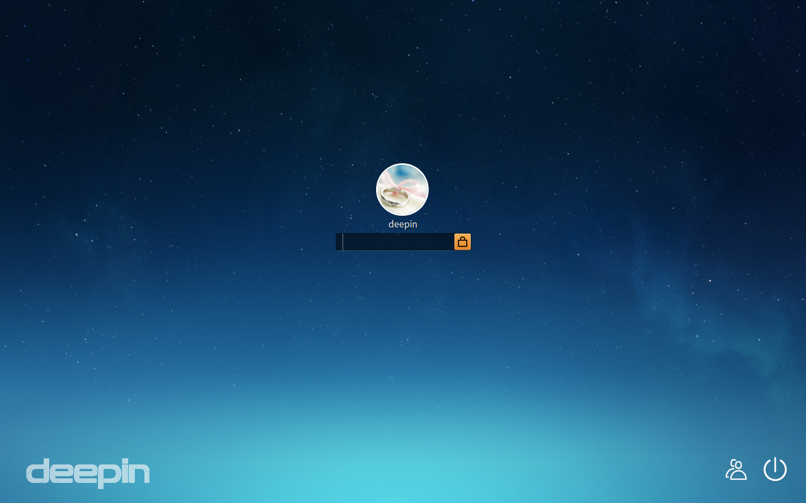

1. On login interface, input the account password.
2. Press  on keyboard or click on .

> : The default account is the username and password set in the installation process. You can create a new account after logging in, specific operation refers to [Create New Account](dman:///deepin-controlcenter#Create New Account).

* If there are several accounts set in the computer, the  will be displayed in the lower right corner of login interface. Click it to log in with another account, specific operation refers to [Switch User](#Switch User).
* If you want to shutdown or restart, please click on  to enter shutdown interface, specific operation refers to [Enter Shutdown Interface](#Enter Shutdown Interface).

### Lock and Unlock Screen

Lock the screen to protect your account from being used by others.

#### Lock Screen

Sometimes you need to leave the seat for a while during the work, you can lock the screen before leaving the seat if you don't want data to be modified or seen.  Others can use their own accounts to log in.

1. Click on  at the bottom of Control Center.
2. Click on **Lock**.

> : Press + on keyboard to quickly lock your screen.

### Unlock Screen

You need to unlock screen after locked when reusing the computer.

1. On lock interface, input the account password.
2. Press  on keyboard or click on .

### Log Out

Clear the current account information by logging out. The computer will enter the login interface after logging out, then you can use another account to log in.

1. Click on  at the bottom of Control Center.
2. Click on **Log out**.

### Restart

Restart is to run you computer again by restarting it after shutdown.

1. Click on  at the bottom of Control Center.
2. Click on **Restart**.

### Switch User

If there are several accounts in your computer, after logging out or locking the screen, you can use another account to log in.

1. Click on  at the bottom of Control Center.
2. Click on **Switch user** to view all accounts in your computer.
3. Select an account.
4. Input the account password.
5. Press  on keyboard or click on  to log in again.

### Suspend and Wake

#### Suspend

Suspend mode is an power-saving mode. Computer will automatically be suspended if there is no operations for a long time. After the computer being suspended, the entire system will be running with low consumption.

1. Click on  at the bottom of Control Center.
2. Click on **Suspend**.

> : You can set the time for suspend mode according to your need, specific operation refers to [Power Conservation Operation](dman:///deepin-controlcenter#Power Conservation Operation).

#### Wake

Your computer will restore to the previous working status after being woke up.

If you want to restore to working status from suspend mode, you can:

* Move the mouse randomly.
* Press any key on keyboard.
* Quickly press the power button.

## Desktop Environment|common/icon_desktopenvironment.svg|

### Dock

Dock is usually displayed at the bottom of the desktop to help you fix frequently used applications. You can find it from anywhere on your computer by the mouse.

<table class="block1">
    <caption>Icon Description</caption>
    <tbody>
        <tr>
            <td></td>
            <td>Click to enter into launcher interface</td>
            <td class="blank"></td>
            <td></td>
            <td>Click to open Deepin Store</td>
        </tr>
        <tr>
            <td></td>
            <td>Click to open Deepin Movie</td>
            <td class="blank"></td>
            <td></td>
            <td>Click to open Deepin Music</td>
        </tr>
        <tr>
            <td></td>
            <td>Click to open webpages</td>
            <td class="blank"></td>
            <td></td>
            <td>Click to open control center panel</td>
        </tr>
        <tr>
            <td></td>
            <td>Click to open file manager</td>
            <td class="blank"></td>
            <td></td>
            <td>Click to open the interface of network settings</td>
        </tr>
        <tr>
            <td></td>
            <td>Click to open the interface of sound settings</td>
            <td class="blank"></td>
            <td></td>
            <td>To display the running applications</td>
        </tr>
        <tr>
            <td></td>
            <td>Click to open the date and time interface</td>
            <td class="blank"></td>
            <td></td>
            <td>Click to open the trash</td>
        </tr>
    </tbody>
</table>

### Launcher

Launcher helps you manage all applications installed in your system, and you can quickly find the needed applications by category navigation or searching function.

> : You can enter into launcher to view applications newly installed in the system. There will be a small blue dot prompt on the left of newly installed applications.

### Control Center

Control Center allows you to view and make basic system settings, including changing user account and setting screen display, etc. For details, please refer to the manual of **Control Center**.

### Window Manager

窗口管理器可以在不同的工作区内展示不同的窗口内容，通过窗口管理器您可以对桌面窗口进行分组管理。

### Trash

All files deleted in the computer can be found in trash, they can be resumed or emptied.

#### Restore Files

You can restore files deleted by mistake by executing the following operations:

1. Select file to restore in Trash.
2. Click on **Restore**.

> : Restore is to restore the file in the trash to its original directory. But if empty operation has been executed in trash, then it is unable to restore the files in trash.

#### Empty Trash

Empty trash to release more usable space in your disk.

1. In trash, click on **Empty**.
2. Click on **Empty Trash**.

## Basic Operations|common/icon_basicoperation.svg|

### Personalize Desktop

Desktop is the interface for human and computer to interact, and helps you to manage the applications.

You can select some elegant and fashionable wallpapers to beautify desktop and make it distinctive.

1. On desktop, click the right mouse button.
2. Click on **Personalize** to open the interface of personalized settings.

> : Specific operation of personalized settings refers to [Personalization](dman:///deepin-controlcenter#Personalization).

###  Set Display

You can adjust the visual perception by setting the screen resolution, brightness and so on.

1. On desktop, click the right mouse button.
2. Click on **Display settings** to open the interface of display settings.

> : Specific operation of display settings refers to [Single Screen Settings](dman:///deepin-controlcenter#Single Screen Settings).

### Set Dock

#### Switch Display Mode

There are three display modes of Dock, which are fashion mode, efficient mode and classic mode.

* **Fashion mode**: The display mode is similar to Mac OS and displayed by a tray at the bottom of screen. All fixed application icons will be displayed on Dock.

* **Efficient mode**: The display mode is similar to Windows 7 and displayed by a small strip at the bottom of screen. Application icons fixed on Dock by default will be displayed in small ones, and icons of same types will be merged together to save more space for others.

* **Classic mode**: The display mode is similar to Windows XP and displayed by a small strip at the bottom of screen. Icons of same types will be displayed separately to quickly view and switch.

You can switch the display mode by the following operations:

1. On desktop, move the mouse pointer over Dock.
2. Click the right mouse button.
3. Select a display mode.

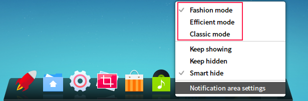

#### Show/Hide Dock

You can hide the dock to extend the operational area on desktop furthest.

1. On desktop, move the mouse pointer over Dock.
2. Right-click, you can:

   * Select **Keep showing**, Dock will be displayed at the bottom of desktop all the time.
   * Select **Keep hidden**, Dock will be hidden and only displayed when mouse hovering on Dock.
   * Select **Smart hide**, Dock will be automatically hidden when Dock area needs to be used.

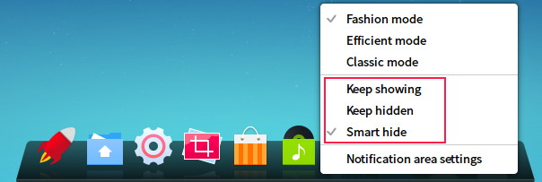

#### Notification Area Settings

Notification area is used to display time, sound, network and so on.

* If Dock is displayed in efficient mode or classic mode, the notification area will be displayed in the right side of Dock.
* If Dock is displayed in fashion mode, the notification area will be displayed on Dock.

Some icons will be displayed in notification area by default, such as network and sound. You can hide or display these icons by executing the following operations:

1. On desktop, move the mouse pointer over Dock.
2. Right click to select **Notification area settings**.
3. Slide the button leftwards or rightwards to enable or disable the icon of network and sound.

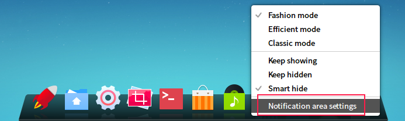

### Corner Navigation

Corner navigation is to simplify your operation and helps you quickly enter the main interface.

#### View Hot Corners

1. On desktop, click the right mouse button.
2. Click on **Corner navigation**, then the whole screen will get dark and the corresponding hot corner function will be displayed on the four top corners of the screen.
3. If you want to exit corner navigation, please click the mouse in the blank area of desktop.

#### Change Hot Corners

You can reset the hot corner function of four top corners on the screen.

1. On desktop, click the right mouse button.
2. Click on **Corner navigation**.
3. Move the mouse pointer at a top corner of the desktop, and then select one in the option.

## Management of Applications|common/icon_applicationmanagement.svg|

You can view all installed applications in launcher.

### Sort Applications

All applications in launcher will be displayed by name by default.

There are five sorting ways of applications for your to select:

* **By name**: Applications will be displayed by name.
* **By category (icon)**: Classification navigation is displayed by icons on the left of launcher, and applications are displayed on the right of launcher by the order of the classification navigation.
* **By category (text)**: Classification navigation is displayed by texts on the left of launcher, and applications are displayed on the right of launcher by the order of the classification navigation.
* **By time installed**: Applications will be displayed by time installed.
* **By frequency**: Applications will be displayed by frequency.

You can select the sorting way by executing the following operations:

1. In Launcher, move the mouse pointer over .
2. Select a sorting way.

### Search Applications

In Launcher, scroll up and down the mouse wheel to find the application you need. You may also locate the application you need faster with the category navigation on the left if the applications are sorted by category (icon) or by category (text).

Of course, if you already know the name of the application, you can locate it even faster by type in the keywords.

1. In Launcher, type in a word such as "deepin" with keyboard.
2. System will automatically search for all applications which contain the keyword "deepin", and then display the searched result in Launcher.

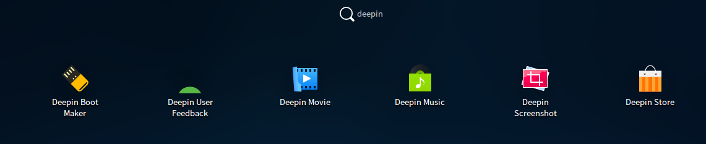

### Set Shortcuts for Applications

Shortcut is an easy and convenient way to launch applications.

#### Create Shortcuts

You can choose to send the application to desktop or dock to facilitate follow-up operations.

1. In Launcher, move the mouse pointer to the application icon.
2. Right-click the icon, you can:

   * Click on **Send to desktop** to create a shortcut on desktop.
   * Click on **Send to dock** to fix the application to Dock.
   * Click on ** Add to autostart** to add the application to autostart, it will automatically run when the computer boots.

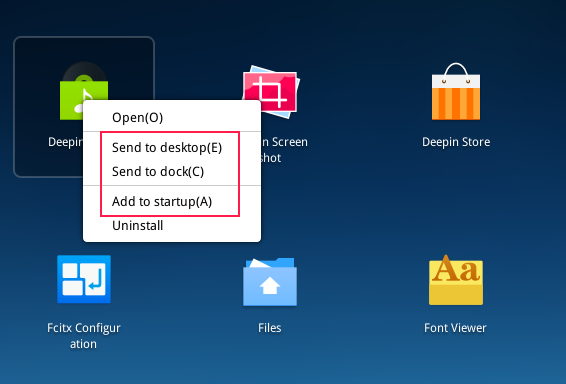

> : By mouse you can drag the application icon from Launcher or desktop to drop it on Dock . But, you can not drag and drop the application while it is running. At this time you can right-click the application icon on Dock and select **Dock** to fix it on Dock. So that you can quickly open it on Dock.

#### Delete Shortcuts

1. In Launcher, move the mouse pointer to the application icon.
2. Right-click the icon, you can:

   * Click on **Remove from dock** to remove the dock-fixed application from Dock.
   * Click on **Remove from desktop** to delete the shortcut on desktop.
   * Click on **Remove from autostart** to remove the application from autostart.

> : Remove application fixed on Dock can also be done by pressing and holding the left mouse button to drag the application icon away from Dock. But, you can not drag and remove the application while it is running. At this time you can right-click the application icon on Dock and select **Undock** to remove it from Dock.

### Run Applications

### Run applications and execute all sorts of operations!

1. In Launcher, move the mouse pointer to the application icon.
2. Right­click the application icon to select **Open** or directly click the application icon.

For those whose desktop shortcuts have been created or fixed on Dock, you can also open them by the following ways:

* Right-click the desktop icon and select **Open** or double-click the desktop icon.
2. Right-click the application icon to select **Run** or directly click the application icon on Dock.

### Uninstall Applications

You can choose to uninstall applications you no longer use to save disk space.

1. In Launcher, right-click the application icon.
2. Click on **Uninstall**.

> : Application can also be uninstalled by directly dragging the application icon from launcher into .

### Application Group

You can manage application icons on desktop by the application group, multiple applications can be contained in one application group.

#### Create Application Group

1. On desktop, move the mouse pointer to the application icon.
2. Press and hold the left mouse button to drag the application icon over another one.
3. Release the left mouse button to complete creating an application group.
4. Please repeat step 2 and step 3 to add other application icons into the application group.

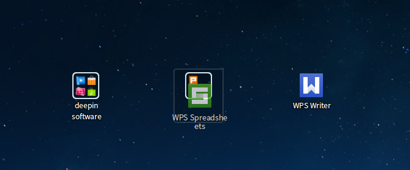

#### Rename Application Group

1. On desktop, move the mouse pointer to the application group.
2. Click the right mouse button and select **Rename**.
3. Input a new name for the application group.

### Trigger Application Group

Trigger an application group to run the applications insides it.

1. On desktop, move the mouse pointer to the application group.
2. Right-click the application group and select **Open** or directly click it, now all applications in the application group will be expanded and displayed.
3. Click the application to run.

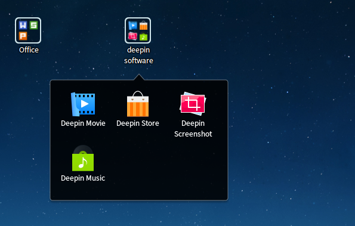

### Dissolve Application Group

If you are sure that you no longer need application group to manage applications, you can dissolve it.

1. On desktop, move the mouse pointer to the application group.
2. Click the right mouse button and select **Ungroup**.

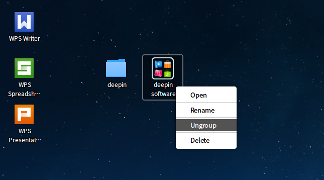

### Delete Application Group

1. On desktop, move the mouse pointer to the application group.
2. Click the right mouse button and select **Delete*.

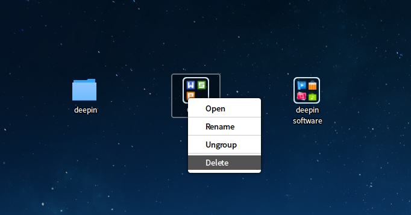

>  : The applications within the application group will not be uninstalled when executing the operation of dissolving or deleting it. Among which the application icons will be distributed on desktop after dissolving, and the application icons will be removed from desktop after deleting. But the applications are still in the system and you can see them in launcher.

## Desktop File Management|common/icon_desktopfilemanagement.svg|

### Sort Files

You can sort the files stored on desktop by certain rules to make desktop tidier.

1. On desktop, click the right mouse button.
2. Click on **Sort by**, you can:

  * Click on **Name** to display files in the order of their names.
  * Click on **Last modified time** to sort display files in the order of their last modified time.

### Create New Files

1. On desktop, click the right mouse button.
2. Click on **New**.
3. Select type for the new file.
4. Input name for the new file.

### Rename Files

1. On desktop, right click the file.
2. Click on **Rename**.
3. Input a new name for new file.

### Copy/Cut Files

Files on desktop can be pasted to other locations to store.

1. On desktop, right click the file.
2. Click on **Copy** or **Cut**.
3. Select a target storage directory.
4. Click the right mouse button to select **Paste**.

### Compress/Uncompress Files

Files can be compressed to packages to save disk space.

1. On desktop, right click the file.
2. Click on **Compress**.
3. Input name for the package, select package type and target storage directory.
4. Click on **Create**.

Compressed files can be extracted to one or more original files. To extract a file, you can:

1. On desktop, right click the compressed file.
2. Click on **Extract** or **Extract Here**.
3. Select a target storage directory.
4. Click on **Extract**.

### View File Property

1. On desktop, right click the file.
2. Click on **Properties** to view or change the basic information and permissions.

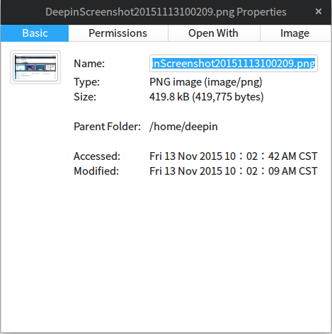

### Delete File

1. On desktop, right click the file.
2. Click on **Delete**.

## Workspace Operations|common/icon_workspacemanagement.svg|

工作区是将您的桌面窗口进行分组管理，通过划分工作区可以增大您的工作区域。

### 了解快捷键

窗口管理器已经预设了常用的快捷键，使用各种快捷键您就能完成对窗口和工作区的相关操作！

> ：您可以进入 **控制中心** > **快捷键** 查看窗口管理器相关的快捷键。

<table class="block1">
    <tbody>
        <tr>
            <td>显示工作区</td>
            <td>Super + S</td>
        </tr>
       <tr>
            <td>显示当前工作区的窗口</td>
            <td>Super + W</td>
        <tr>
            <td>显示所有工作区的窗口</td>
            <td>Super + A</td>
        </tr>
        <tr>
            <td>切换窗口</td>
            <td>Alt + Tab</td>
        </tr>
        <tr>
            <td>反向切换窗口</td>
            <td>Alt + Shift + Tab</td>
        </tr>
        <tr>
            <td>切换同类型窗口</td>
            <td>Alt + ~</td>
        </tr>
         <tr>
            <td>反向切换同类型窗口</td>
            <td>Alt + Shift + ~</td>
        </tr>
        <tr>
            <td>切换到左边工作区</td>
            <td>Ctrl + Alt + Left</td>
        </tr>
        <tr>
            <td>切换到右边工作区</td>
            <td>Ctrl + Alt + Right</td>
        </tr>
        <tr>
            <td>切换到指定工作区</td>
            <td>Ctrl + Alt + 数字键</td>
        </tr>
        <tr>
            <td>移动到左边工作区</td>
            <td>Ctrl + Alt + Shift + left</td>
        </tr>
        <tr>
            <td>移动到右边工作区</td>
            <td>Ctrl + Alt + Shift + right</td>
        </tr>
        <tr>
            <td>放大屏幕显示</td>
            <td>Super + =</td>
        </tr>
        <tr>
            <td>缩小屏幕显示</td>
            <td>Super + -</td>
        </tr>
        <tr>
            <td>放大/缩小窗口显示</td>
            <td>Super + M</td>
        </tr>
      </tr>
 </table>

### 打开工作区

在桌面上，按下键盘上的  +  组合键打开工作区的管理界面。

 

### 添加工作区

窗口管理器最多支持7个工作区。

当您添加的工作区达到最大值时，预览窗口右侧的  会自动隐藏，此时将不能再执行添加工作区的操作。当删除1个工作区后， 又会自动显示。

在工作区的管理界面，您可以通过以下两种方式添加工作区：

* 点击预览窗口右侧的 ，按下键盘上的   键。
* 按下键盘上的  +  组合键，再按下  键。

  

### 切换工作区

* 在桌面上，按下键盘上的  +  /  组合键，可以切换到上一个/下一个工作区。
* 在桌面上，按下键盘上的  +  +  /  组合键，可以切换到上一个/下一个工作区。
* 在桌面上，按下键盘上的  +  + **数字键**，可以切换到指定的工作区。
* 在工作区的管理界面，通过上下滚动鼠标滚轮或按下键盘上的  +  /  组合或键来切换到上一个/下一个工作区。
* 在工作区的管理界面，通过点击对应的预览窗口或按下键盘上的  + **数字键** 来切换到指定工作区。

>  ：在工作区的管理界面，您还可以直接按下键盘上的 / 键来切换到上一个/下一个工作区。

 

### 命名工作区

1. 在工作区的管理界面，点击预览窗口下面的工作区编号或按下键盘上的  键，将会出现输入光标。
2. 输入工作区名称。
3. 按下键盘上的   键。

> ：工作区编号主要是为了标示各个工作区，因此在执行命名工作区的操作时，工作区编号并不会被重命名。

### 删除工作区

* 在工作区的管理界面，点击预览窗口右上角的 ，删除指定的工作区。
* 在工作区的管理界面，选中预览窗口，按住鼠标左键不放，将预览窗口向上拖拽，删除指定的工作区。
* 在工作区的管理界面，每按下一次键盘上的  +  组合键，将向左或向右逐次删除工作区。

> ：当您执行删除工作区操作后，该工作区中的所有窗口将自动转移到相邻的工作区中显示，当桌面环境中只存在一个工作区时，将不能执行删除工作区的操作。

### 退出工作区

* 按下键盘上的  键。
* 在工作区管理界面的任意位置点击一下鼠标。
* 再次按下键盘上的  +  组合键。

## Window Operations|common/icon_windowmanagement.svg|

### 在工作区切换窗口

在工作区的管理界面，当前工作区中所有打开的窗口都将平铺展开来显示。

- 按下键盘上的  键，将切换到当前窗口的下一个窗口。
- 按下键盘上的  +  键，将切换到当前窗口的上一个窗口。

### 在工作区移动窗口

在工作区的管理界面，将当前工作区中的窗口移动到另一个工作区。

1. 在工作区的管理界面，将鼠标指针置于窗口上，此时选中窗口的右上角会出现 。
2. 按住鼠标左键不放，将窗口拖拽到指定的预览窗口中。
3. 释放鼠标左键，完成窗口的移动。

  

### 在工作区关闭窗口

在工作区的管理界面，您可以非常快速的关闭在桌面上已经打开的窗口。

1. 在工作区的管理界面，将鼠标指针置于窗口上，此时选中窗口的右上角会出现 。
2. 点击 。

 

### 在桌面显示窗口

* 在桌面上，按下键盘上的  +  组合键，显示所有工作区的窗口。
* 在桌面上，按下键盘上的  +  组合键，显示当前工作区的窗口。

### 在桌面切换窗口

* 在桌面上，按住键盘上的  键不放，连续按下键盘上的  键，窗口依次向右切换显示；连续按下键盘上的   + 键，窗口依次向左切换显示。
* 在桌面上，按住键盘上的  键不放，连续按下键盘上的  键，当前同类型窗口依次向右切换显示；连续按下键盘上的   +   键，当前同类型的窗口依次向左切换显示。

### 在桌面移动窗口

* 在桌面上，按下键盘上的  +  +  /  键，将当前窗口移动到上一个/下一个工作区；按下键盘上的  +  + **数字键**，可以将当前窗口移动到指定的工作区。
* 在桌面上，按下键盘上的  +  +  +  /  键，将当前窗口移动到上一个/下一个工作区；按下键盘上的  +  +  + **数字键**，可以将当前窗口移动到指定的工作区。

