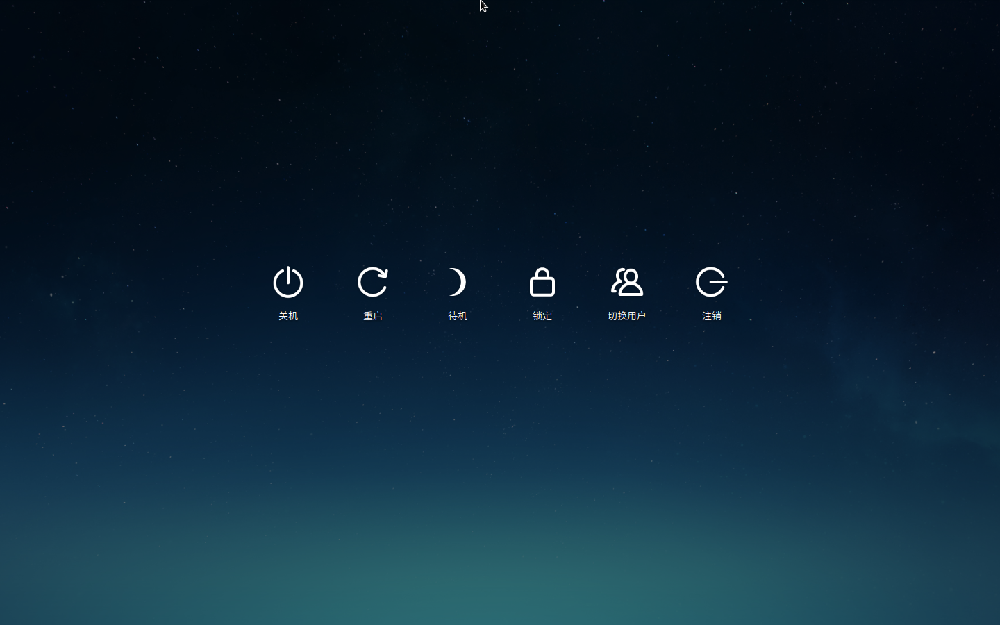
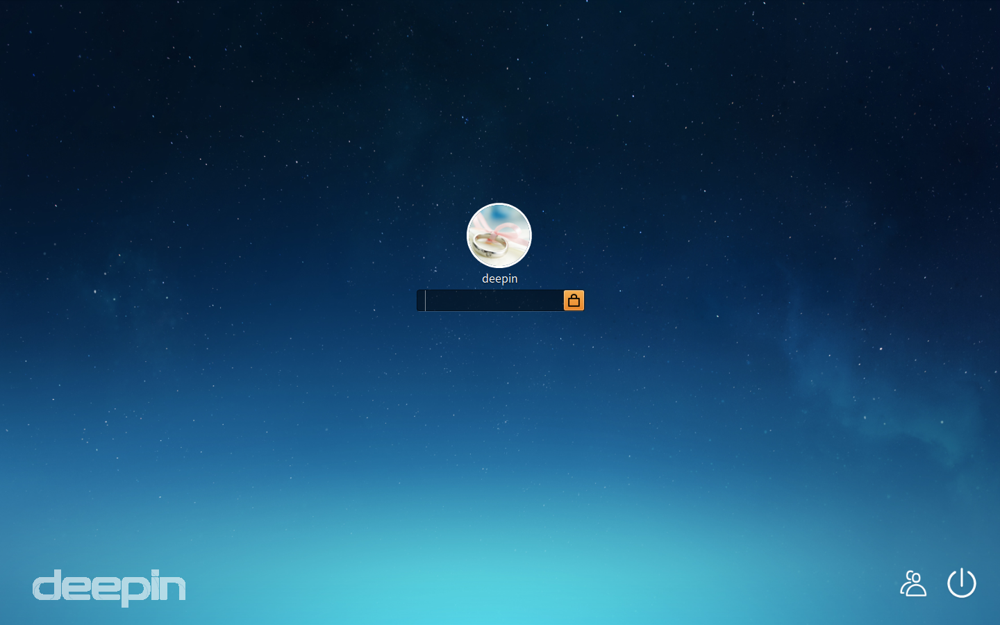
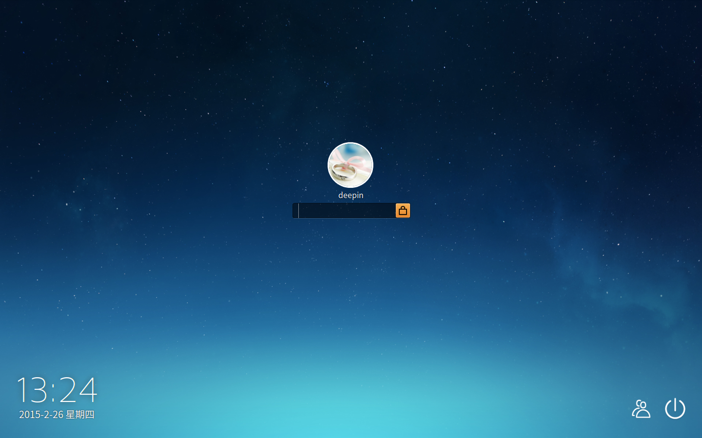
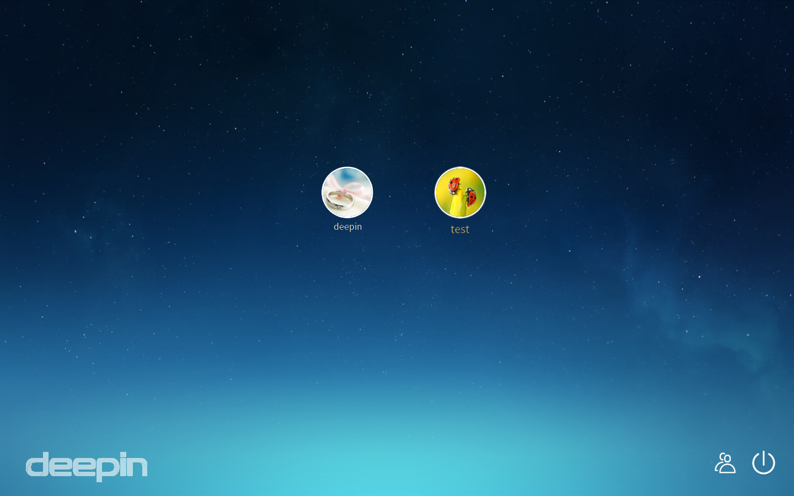

# Sistema Operativo deepin|../common/deepin-system.svg|
## Panoramica|../common/icon_overview.svg|

deepin 15 è il sistema operativo Desktop Linux pubblicato da Deepin Technology Co., Ltd. a dicembre del 2015. In deepin sono preinstallate le applicazioni WPS Office, Sogou Input Method, il dizionario Youdao ed altre applicazioni deepin. Il sistema ti consente di sperimentare una moltitudine di attività ricreative, ma anche di provvedere alle tue necessità quotidiane. Crediamo che deepin sarà amato ed usato da sempre più utenti, dato che le funzionalità vengono continuamente migliorate e perfezionate.

## Guida|../common/icon_guide.svg|

### Avvio del Launcher e del Centro di controllo
La navigazione angolare è impostata, in modo predefinito, per i quattro angoli della scrivania e tramite questa puoi accedere rapidamente al Centro di controllo ed al Launcher.

* Il Launcher può essere aperto muovendo il puntatore del mouse sull'angolo superiore sinistro della scrivania.
Clicca in qualsiasi punto per nascondere il Launcher e tornare alla scrivania.

* Il Centro di controllo può essere aperto muovendo il puntatore del mouse sull'angolo inferiore destro della scrivania. Clicca in qualsiasi punto esterno al pannello per uscire.

> : Puoi anche eseguire il reset dell'angolo di navigazione del Launcher e del Centro di controllo. Per le operazioni specifiche da svolgere fai riferimento a [Navigazione angolare](#Navigazione angolare).

### Accedere all'interfaccia di Spegnimento
Dall'interfaccia di spegnimento, puoi scegliere lo spegnimento, il riavvio, la disconnessione dell'utente corrente, il blocco della sessione corrente, etc...

1. Muovi il puntatore del mouse sopra l'angolo inferiore destro della scrivania per aprire il Centro di controllo.
2. Clicca su  sulla parte inferiore del Centro di controllo per accedere all'interfaccia di spegnimento.
3. Se desideri uscire dall'interfaccia di spegnimento, premi  sulla tastiera o clicca col mouse sull'area vuota.

> : Puoi accedere all'interfaccia di spegnimento anche cliccando su shutdowninterface  dalla Dock. 

### Boot e Spegnimento

#### Boot
Accendi il computer per iniziare la tua sessione di lavoro. Premi il pulsante di accensione dopo aver collegato il tuo computer per avviare il boot.

#### Spegnimento
1. Clicca su  nella parte inferiore del Centro di controllo.
2. Clicca su **Spegnimento** o premi  sulla tastiera.

### Autenticazione
Una volta avviato il boot, hai bisogno di creare un account per autenticarti prima di eseguire altre operazioni.

1. Nell'interfaccia di autenticazione, immetti la parola d'accesso associata all'account.
2. Premi  sulla tastiera o clicca su !.

> : L'account predefinito consiste nel nome utente e nella parola d'accesso impostate durante il processo d'installazione. Puoi creare un nuovo account dopo esserti autenticato. Per le operazioni specifiche da svolgere puoi fare riferimento a [Creazione di un nuovo account](dman:///dde-control-center#Creazione di un nuovo account).

Puoi eseguire anche le seguenti operazioni:

- Se ci sono molti account impostati nel computer, clicca su  nell'angolo inferiore destro dell'interfaccia di accessoo per cambiare l'account utente. Per le operazioni specifiche da svolgere puoi fare riferimento a [Switch User](#Cambio utente).

- Se desideri spegnere il computer, riavviarlo o sospendere la sessione corrente, clicca su  per accedere all'interfaccia di spegnimento; per le operazioni specifiche puoi fare riferimento a [Enter Shutdown Interface](#Accedere all'interfaccia di Spegnimento).

### Blocco e sblocco dello schermo
Blocca lo schermo per proteggere il tuo account dall'utilizzo improprio, da parte di altri, dei dati accessibili dalla tua sessione.

#### Blocco schermo
Qualche volta si ha la necessità di abbandonare temporaneamente la propria postazione durante la sessione lavorativa ma, qualora tu non voglia che i dati vengano modificati o visti da altri, puoi bloccare lo schermo prima di lasciare la postazione incustodita. Le altre persone possono usare i loro account per autenticarsi.

1. Clicca su  nella parte inferiore del Centro di controllo.
2. Clicca su **Blocca**.

> : Premi + sulla tastiera per bloccare il tuo schermo rapidamente.

### Sblocco schermo
Per poter utilizzare nuovamente il computer, devi sbloccare lo schermo dopo averlo bloccato.

1. Nell'interfaccia di blocco, immetti la parola d'accesso associata all'account.
2. Premi  sulla tastiera o clicca su .

### Disconnessione
Pulisce le informazioni dell'account corrente disconnettendo lo stesso. Il computer accederà all'interfaccia di autenticazione una volta avvenuta la disconnessione; successivamente puoi usare un altro account per autenticarti.

1. Clicca su  nella parte inferiore del Centro di controllo.
2. Clicca su **Disconnetti**.

### Riavvio
Il riavvio serve ad avviare nuovamente il tuo computer dopo lo spegnimento.

1. Clicca su  nella parte inferiore del Centro di controllo.
2. Clicca su **Riavvia**.

### Cambio utente
Se ci sono molteplici account nel tuo computer, dopo esserti disconnesso o dopo aver bloccato lo schermo, puoi usare un altro account per accedere.

1. Clicca su  nella parte inferiore del Centro di controllo.
2. Clicca su **Cambia utente** per visionare tutti gli account disponibili nel tuo computer.
3. Seleziona un account.
4. Immetti la parola d'accesso dell'account.
5. Premi  sulla tastiera o clicca su  per accedere nuovamente.

