# 深度操作系统|../common/deepin-system.svg|
## 概述|../common/icon_overview.svg|

深度操作系统是深度科技发行的美观易用、安全可靠的国产桌面操作系统。深度系统预装了 WPS Office、搜狗输入法、有道词典以及一系列深度特色应用。它既能让您体验到丰富多彩的娱乐生活，也可以满足您的日常工作需要。相信随着功能的不断升级和完善，深度操作系统将会被越来越多的用户所喜爱和使用。

## 使用入门|../common/icon_guide.svg|

### 打开启动器和控制中心
桌面的四个角落已经默认设置了热区，通过热区您可以快速打开启动器和控制中心。

- 将鼠标指针置于桌面左上角即可打开启动器，在启动器的任意位置点击一下鼠标则从启动器界面返回到桌面。

- 将鼠标指针置于桌面右下角即可打开控制中心，在控制中心面板以外的区域点击一下鼠标则退出控制中心。

> ：您也可以对启动器和控制中心的热区重新进行设置，具体操作请参阅 [设置热区](#设置热区)。

### 进入关机界面
在关机界面，系统会询问您的下一步操作，您可以执行关机、重启、注销、锁定等操作。

 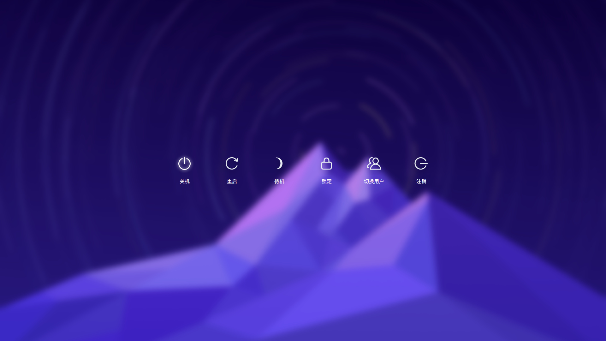

1. 将鼠标指针置于桌面右下角打开控制中心。
2. 点击控制中心底部的  进入关机界面。
3. 如果需要退出关机界面，请按下键盘上的  键或在关机界面的空白处点击一下鼠标。

> ：您也可以点击任务栏中的  关机按钮进入关机界面。

### 开机和关机
#### 开机
打开电脑开始一天的工作吧！当电脑接通电源后，按下主机上的电源按钮，电脑开机。

#### 关机

1. 在控制中心面板，点击底部的 。
2. 点击 **关机** 或按下键盘上的  键。

> ：关机时如果还有其他账户处于登陆状态，为了避免用户数据丢失，需要确认之后才能关机。

### 登录
电脑开机后，在您正式执行各项操作之前，您需要先使用一个帐户来登录电脑。

 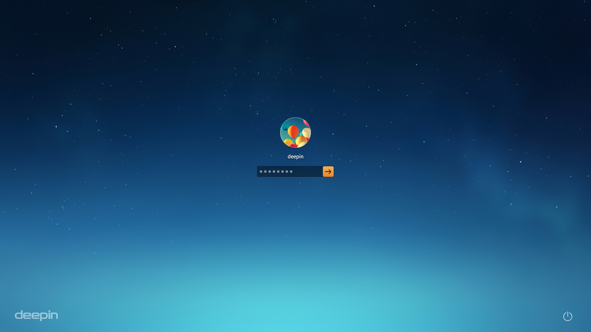

1. 在登录界面，输入登录帐户的对应密码。
2. 按下键盘上的  键或点击 。

> ：电脑默认的登录帐户是您在安装系统时所设置的用户名和密码。登录电脑后，您可以创建新的帐户，具体操作请参阅 [创建新帐户](dman:///dde-control-center#创建新帐户)。

您还可以进行如下操作：

- 如果这台电脑已经设置了多个用户帐户，请点击登录界面右下角的 ，以选择其他的用户帐户来登录，具体操作请参阅 [切换用户](#切换用户)。

- 如果要执行关机/重启/待机等操作，请点击登录界面右下角的  进入关机界面，具体操作请参阅 [进入关机界面](#进入关机界面)。

### 锁屏和解锁屏幕
锁定电脑可以保护您的帐户不被他人使用。

 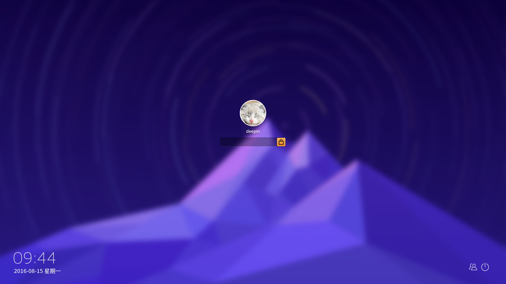

#### 锁屏
工作中有时需要离开座位一会儿，此时如果您不希望自己电脑中的数据被修改或看到，您可以在离开座位之前将电脑屏幕锁定。其他人可以使用他们自己的帐户登录电脑。

1. 在控制中心面板，点击底部的 。
2. 点击 **锁定**。

> ：按下键盘上的 + 组合键，也可以快速锁定您的电脑屏幕。

#### 解锁屏幕
电脑锁定之后，当您重新使用电脑时，需要先解除锁定。

1. 在锁屏界面，输入登录帐户的对应密码。
2. 按下键盘上的  键或点击 。

### 注销
注销是清除当前登录用户的信息。当执行注销操作之后，电脑会重新进入登录界面，此时您可以使用任何一个用户帐户来登录电脑。

1. 在控制中心面板，点击底部的 。
2. 点击 **注销**。

### 重启
重启是关机后再次重新运行您的电脑。

1. 在控制中心面板，点击底部的 。
2. 点击 **重启**。

### 切换用户
如果您的电脑已经设置了多个用户帐户，当注销或锁定电脑后，您可以使用其他的用户帐户来登录电脑。

1. 在控制中心面板，点击底部的 。
2. 点击 **切换用户**，此时您可以看到当前电脑上的所有用户帐户。
3. 选择一个用户帐户。
4. 输入用户帐户的对应密码。
5. 按下键盘上的  键或点击 ，重新登录电脑。

 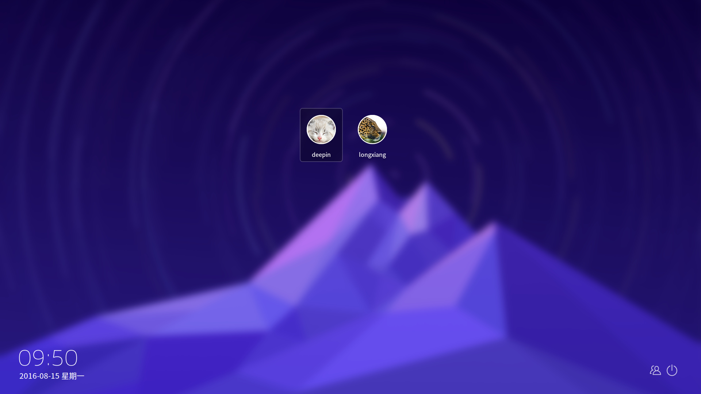

### 待机和唤醒
#### 待机
待机是一种节能模式，如果电脑长时间未执行任何操作，电脑将会自动待机。当电脑待机后，整个系统将处于低能耗运转的状态。

1. 在控制中心面板，点击底部的 。
2. 点击 **待机**。

#### 唤醒
执行唤醒后，您的电脑将迅速恢复到待机前的状态。

如果电脑要从待机模式返回到工作状态，您可以：

* 随意移动一下鼠标。
* 按下键盘上的任意一个按键。
* 快速按一下电脑上的电源按钮。

## 桌面环境|../common/icon_desktopenvironment.svg|

 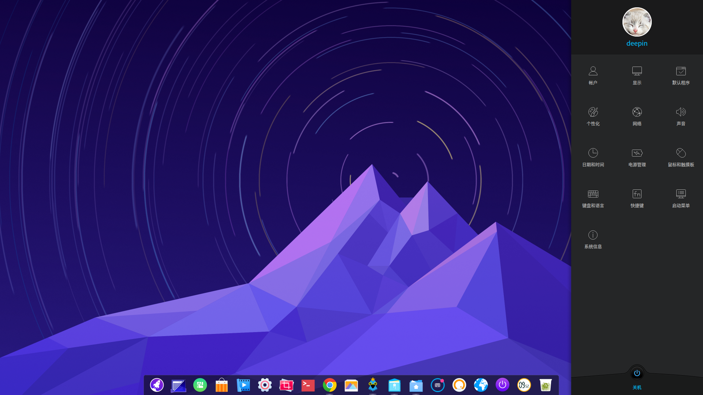

### 任务栏
任务栏帮助您固定常用的应用程序，它通常显示在桌面底部。

 

<table class="block1">
    <caption>图标说明</caption>
    <tbody>
        <tr>
            <td></td>
            <td>点击可进入启动器界面</td>
            <td class="blank"></td>
            <td></td>
            <td>点击可打开深度商店</td>
        </tr>
        <tr>
            <td></td>
            <td>点击可打开深度影院</td>
            <td class="blank"></td>
            <td></td>
            <td>点击可打开深度看图</td>
        </tr>
        <tr>
            <td></td>
            <td>点击可打开网页</td>
            <td class="blank"></td>
            <td></td>
            <td>点击可打开控制中心面板</td>
        </tr>
        <tr>
            <td></td>
            <td>点击可打开文件管理器</td>
            <td class="blank"></td>
            <td></td>
            <td>点击可打开网络设置界面</td>
        </tr>
        <tr>
            <td></td>
            <td>点击可以快速调节音量</td>
            <td class="blank"></td>
            <td></td>
            <td>点击运行深度终端</td>
        </tr>
        <tr>
            <td></td>
            <td>显示电量，点击可快速进入关机界面</td>
            <td class="blank"></td>
            <td></td>
            <td>点击可打开深度日历</td>
        </tr>
		<tr>
            <td></td>
            <td>点击可快速设置无线网络</td>
            <td class="blank"></td>
			<td></td>
            <td>点击可打开回收站</td>
        </tr>
    </tbody>
</table>

> ：当您使用台式机电脑时，仅显示为 图标，当您使用笔记本电脑时，系统默认采用  图标默认显示剩余电量，将鼠标置于图标上时显示剩余电量百分比，点击快速进入关机界面。

### 启动器
启动器帮助您管理系统中已安装的所有应用，在启动器中使用分类导航或搜索功能可以快速找到需要的应用程序。

> ：如果系统中有新安装的应用，您可以进入启动器中去查看。对于新安装的应用，它的旁边会出现一个小蓝点提示。

 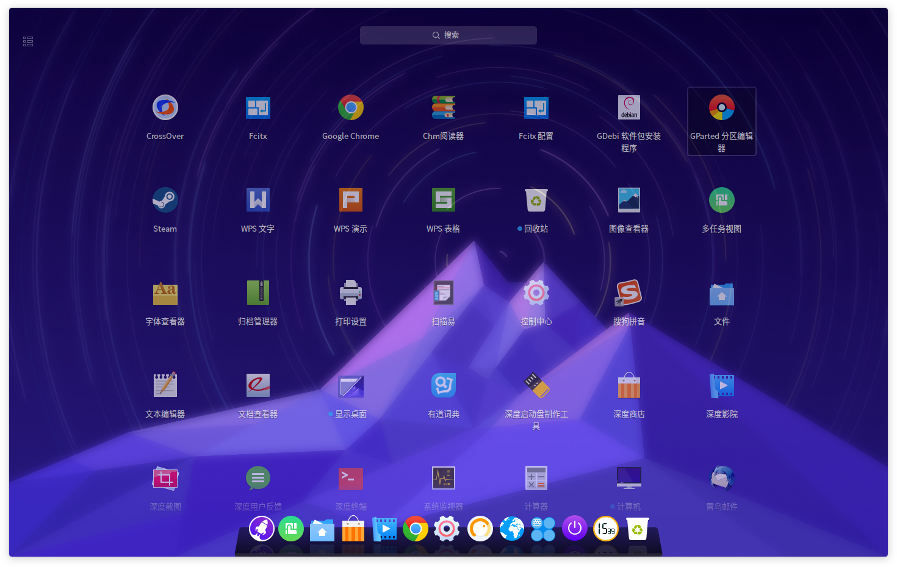

### 控制中心
控制中心允许您查看和进行基本的系统设置，包括更改用户帐户、设置屏幕显示等。

 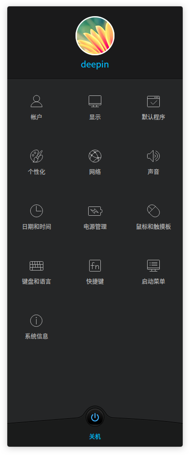

### 窗口管理器
窗口管理器可以在不同的工作区内展示不同的窗口内容，通过窗口管理器您可以对桌面窗口进行分组管理。

 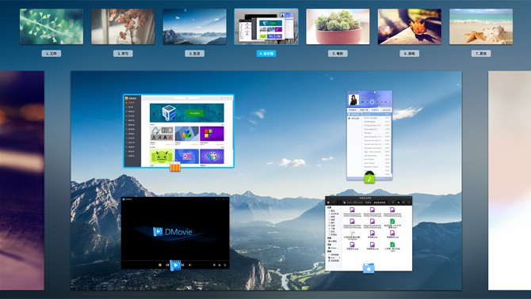

### 回收站
电脑中被删除的所有文件您都可以在回收站中找到，回收站中的文件可以被恢复或清空。

- 通常情况下，您可以打开深度文件管理器来管理回收站。
- 如果您切换到时尚模式，回收站将在任务栏中显示。

#### 恢复文件
对于误删除的文件，您可以通过执行以下操作来恢复：

1. 在回收站中，选择要恢复的文件。
2. 点击 **恢复**。

> ：恢复是将回收站中的文件还原到原来的存储路径下。但是如果回收站已经执行了清空操作，那么文件将不能再恢复。

#### 清空回收站
清空回收站，可以让您的硬盘释放更多的可用空间。

1. 在回收站中，点击 **清空**。
2. 点击 **清空回收站**。

## 基本操作|../common/icon_basicoperation.svg|
电脑桌面是人与电脑进行交互的界面，它帮助您管理桌面上的应用程序。

 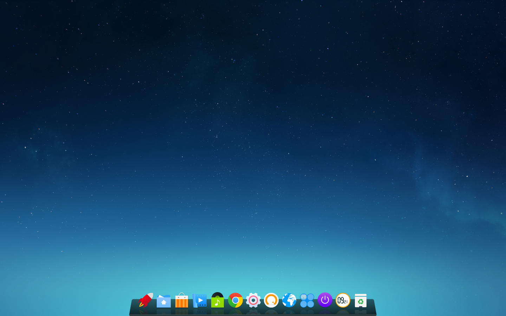

您可以选择一些精美、时尚的壁纸来美化桌面，让您的电脑显示与众不同。

1. 在桌面，点击鼠标右键。
2. 点击 **设置壁纸**，桌面底部弹出壁纸设置界面。
3. 点击要设置的壁纸图片。
4. 选择 **仅设置桌面**/**仅设置锁屏**。

 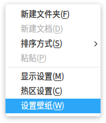

### 设置显示器
您可以通过设置显示器的分辨率、亮度等来调节屏幕的视觉观感。

1. 在桌面，点击鼠标右键。
2. 点击 **显示设置**，打开显示设置界面。

> ：关于显示的设置，具体操作请参阅 [单屏设置](dman:///dde-control-center#单屏设置)。

### 设置热区
热区是为了简化您的操作，方便您快速进入系统的主要界面。

 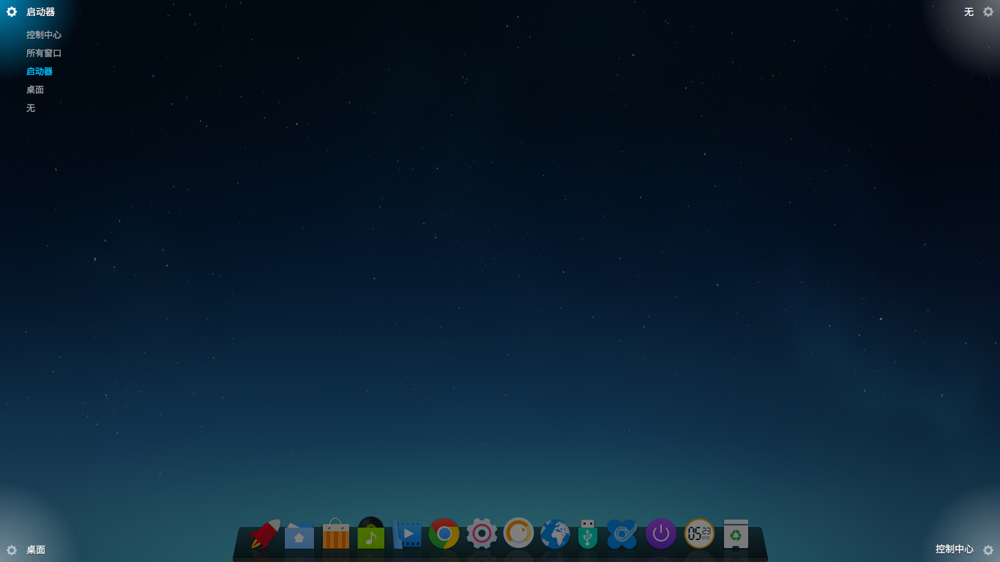

#### 查看热区
您可以点击鼠标右键查看默认热区设置。

1. 在桌面，点击鼠标右键。
2. 点击 **热区设置**，此时整个屏幕会变暗并且在屏幕的四个角落将显示对应的热区功能。
3. 如果要退出热区设置，请在桌面的空白处点击一下鼠标。

#### 修改热区
您可以对桌面四个角落的热区功能重新进行设置。

1. 在桌面，点击鼠标右键。
2. 点击 **热区设置**。
3. 将鼠标指针置于桌面的某个角落，在选项中重新选择一项。

### 设置任务栏
#### 切换显示模式
任务栏提供两种显示模式：时尚模式和高效模式。

- **时尚模式**：任务栏的显示风格类似于Mac OS，以托盘的形式停靠在屏幕下方。任务栏上会显示所有固定在任务栏的应用图标。
- **高效模式**：任务栏的显示风格类似于Windows 7，以小长条的形式显示在屏幕下方。固定在任务栏上的应用图标默认为小图标显示，而且相同类型的图标会合并在一起以腾出更多的空间给其他图标使用。

 
 
 

您可以通过以下操作来切换显示模式：

1. 在桌面，将鼠标指针置于任务栏上。
2. 点击鼠标右键。
3. 在**模式**子菜单中选择一种显示模式。

 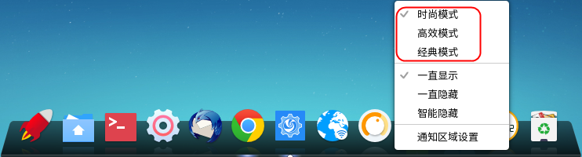

#### 显示/隐藏任务栏
您可以将任务栏隐藏起来，最大程度的扩展桌面的可操作区域。

1. 在桌面，将鼠标指针置于任务栏上。
2. 点击鼠标右键。
3. 选择**状态**，您可以：

  - 选择 **一直显示**，任务栏将会一直显示在桌面底部。
  - 选择 **一直隐藏**，任务栏将会隐藏起来，只有在鼠标移至任务栏区域时才会显示。
  - 选择 **智能隐藏**，当需要占用任务栏区域时任务栏将会自动隐藏。

 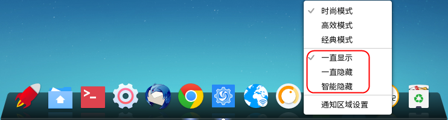

>：按下键盘上的 + 组合键，也可以快速显示/隐藏任务栏。

#### 设置任务栏位置

您可以将任务栏放置在桌面的任意方向。

1. 在桌面，将鼠标指针置于任务栏上。
2. 点击鼠标右键。
3. 在**位置**子菜单中选择一个方向。

 
 
#### 调整任务栏大小

您可根据个人习惯调整任务栏的大小。

1. 在桌面，将鼠标指针置于任务栏上。
2. 点击鼠标右键。
3. 在**大小**子菜单中选择一个大小。

 

## 应用管理|../common/icon_applicationmanagement.svg|
在启动器中您可以查看系统中已安装的所有应用。

### 排列应用

在启动器中，系统默认按照名称排列显示所有应用。

- 将鼠标悬停在应用图标上，按住鼠标左键不放，将应用图标拖拽到指定的位置自由排列。
- 点击启动器界面左上角分类图标进行排列。

1. 在启动器中，将鼠标指针置于左上角的图标上。
2. 点击  图标。
3. 按照分类排列方式显示应用程序图标。
4. 将鼠标悬停在分类图标上，将显示图标以及文字分类。

 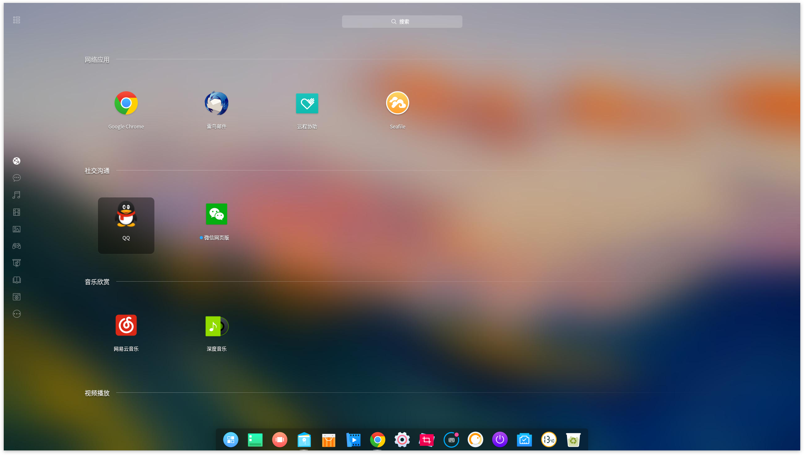
 
### 查找应用

在启动器中上下滚动鼠标滚轮可以找到您需要的应用，您也可以通过切换分类导航来更快的找到需要的应用。

如果您已经知道了应用的名称，通过直接在搜索框中输入关键字快速定位到需要的应用！

1. 在启动器中，通过顶部的搜索框中输入关键字，例如“deepin”。
2. 系统会自动搜索包含关键字“deepin”的所有应用，并且将搜索的结果显示在启动器界面中。

 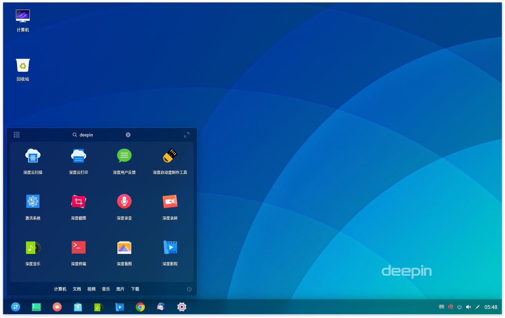

### 设置快捷方式
快捷方式提供了一种简单快捷地启动应用的方法。

#### 创建快捷方式
您可以选择将应用发送到桌面或任务栏上，便捷您的后续操作。

1. 在启动器中，将鼠标指针置于应用的图标上。
2. 右键单击应用图标，您可以：
   - 点击 **发送到桌面**，在桌面创建快捷方式。
   - 点击 **发送到任务栏**，将应用固定到任务栏。
   - 点击 **开机自动启动**，将应用添加到开机启动项，在电脑开机时自动运行该应用。

 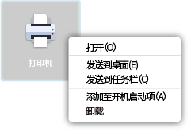

>：您可以通过鼠标将应用的图标从启动器拖拽到任务栏上放置。但是当应用处于运行状态时您将无法拖拽固定，此时您可以右键单击任务栏上的应用图标，选择 **驻留** 将应用固定到任务栏，以便在下次使用时能够从任务栏上快速打开。

#### 删除快捷方式
您可以从桌面、任务栏等删除应用的快捷方式。

1. 在启动器中，将鼠标指针置于应用的图标上。
2. 右键单击应用图标，您可以：
   - 点击 **从桌面上移除**，删除桌面快捷方式。
   - 点击 **从任务栏上移除**，将固定到任务栏上的应用移除。
   - 点击 **取消开机自动启动**，从开机启动项中移除该应用。

 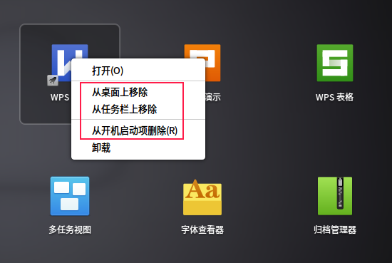

> ：按住鼠标左键不放，将应用图标拖拽到任务栏以外的区域进行移除，当应用处于运行状态时您将无法拖拽移除，此时可以右键单击任务栏上的应用图标，选择 **移除驻留** 将应用从任务栏上移除。

### 运行应用
对于已经创建了桌面快捷方式或固定到任务栏上的应用，您可以通过以下途径来打开应用。

- 双击桌面图标或右键单击桌面图标选择 **打开**。
- 直接点击任务栏上的应用图标或右键单击任务栏上的应用图标选择 **运行**。

如果该应用在启动器界面中，可以通过以下步骤来打开应用。

1. 在启动器中，将鼠标指针置于应用图标上。
2. 直接点击应用图标或右键单击应用图标选择 **打开**。

### 卸载应用
对于不再使用的应用，您可以选择将其卸载，以节省硬盘空间。

1. 在启动器中，右键单击应用图标。
2. 点击 **卸载**。

 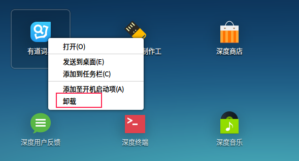

> ：在 **时尚模式** 下，您还可以在启动器界面，按住鼠标左键不放，将应用图标拖拽到  中卸载应用。

## 桌面文件管理|../common/icon_desktopfilemanagement.svg|

您可以根据自己的实际情况对桌面上的文件进行相关操作。

### 排列文件

1. 在桌面，点击鼠标右键。
2. 点击 **排序方式**，您可以：
  - 点击 **按名称**，将按文件的名称顺序显示。
  - 点击 **按大小**，将按文件的大小顺序显示。
  - 点击 **按类型**，将按文件的类型顺序显示。
  - 点击 **按修改日期**，文件将按最近一次的修改日期顺序显示。

 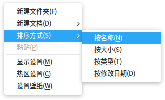

### 新建文件

1. 在桌面，点击鼠标右键。
2. 点击 **新建文档**。
3. 选择新建文件的类型。
4. 输入新建文件的名称。

 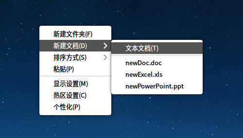

### 新建文件夹

1. 在桌面，点击鼠标右键。
2. 点击 **新建文件夹**。
3. 输入新建文件夹的名称。

### 重命名文件

1. 在桌面，右键单击文件。
2. 点击 **重命名**。
3. 输入一个新的文件名称。

### 复制/剪切文件

1. 在桌面，右键单击文件。
2. 点击 **复制**或**剪切**。
3. 选择一个目标存储位置。
4. 点击鼠标右键，然后选择 **粘贴**。

### 压缩/解压缩文件

1. 在桌面，右键单击文件。
2. 点击 **压缩**。
3. 输入压缩包名称，选择压缩包类型和目标存储位置。
4. 点击 **创建**。

 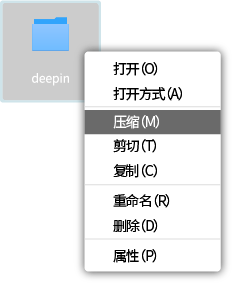

压缩文件也可以解压出来还原成一个或多个文件。如果要解压缩一个文件，您可以：

1. 在桌面，右键单击压缩文件。
2. 点击 **解压到此处**。
3. 压缩文件将被解压到桌面上。

> ：您还可以在桌面上双击压缩文件，点击 **提取**，选择目标存储位置，再次点击 **提取** 即可完成解压操作。

### 查看文件属性

1. 在桌面，右键单击文件。
2. 点击 **属性**，可以查看或更改文件的基本信息和权限。

 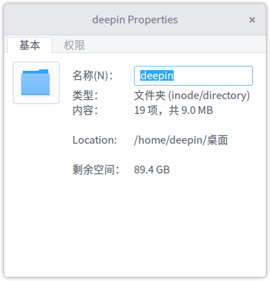

### 删除文件

1. 在桌面，右键单击文件。
2. 点击 **删除**。

## 工作区管理|../common/icon_workspacemanagement.svg|
工作区是将您的桌面窗口进行分组管理，通过划分工作区可以增大您的工作区域。

### 了解快捷键
窗口管理器已经预设了常用的快捷键，使用各种快捷键您就能完成对窗口和工作区的相关操作！

> ：您可以进入 **控制中心** > **快捷键** 查看窗口管理器相关的快捷键。

<table class="block1">
    <tbody>
        <tr>
            <td>显示工作区</td>
            <td>Super + S</td>
        </tr>
       <tr>
            <td>显示当前工作区的窗口</td>
            <td>Super + W</td>
        <tr>
            <td>显示所有工作区的窗口</td>
            <td>Super + A</td>
        </tr>
        <tr>
            <td>切换窗口</td>
            <td>Alt + Tab</td>
        </tr>
        <tr>
            <td>关闭窗口</td>
            <td>Alt + F4</td>
        </tr>
        <tr>
            <td>最大化窗口</td>
            <td>Super + Up</td>
        </tr>
         <tr>
            <td>恢复窗口</td>
            <td>Super + Down</td>
        </tr>
        <tr>
            <td>移动窗口</td>
            <td>Alt + F7</td>
        </tr>
        <tr>
            <td>改变窗口大小</td>
            <td>Alt + F8</td>
        </tr>
 </table>

### 打开工作区

在桌面上，按下键盘上的  +  组合键打开工作区的管理界面。

### 添加工作区

在工作区的管理界面，您可以通过以下两种方式添加工作区：

* 点击预览窗口右侧的 ，按下键盘上的   键。
* 按下键盘上的  +  组合键，再按下  键。

当您添加的工作区达到最大值时，预览窗口右侧的  会自动隐藏，此时将不能再执行添加工作区的操作。当删除1个工作区后， 又会自动显示。

> ：窗口管理器最多支持7个工作区。

### 切换工作区

* 在桌面上，按下键盘上的  +  /  组合键，可以切换到上一个/下一个工作区。
* 在工作区的管理界面，您可以直接按下键盘上的  / 键来切换到上一个/下一个工作区。
* 在工作区的管理界面，通过点击对应的预览窗口或按下键盘上的 **数字键** 来切换到指定工作区。

### 命名工作区

工作区编号主要是为了标示各个工作区，因此在执行命名工作区的操作时，工作区编号并不会被重命名。

1. 在工作区的管理界面，点击预览窗口下面的工作区编号或按下键盘上的  键，将会出现输入光标。
2. 输入工作区名称。
3. 按下键盘上的   键。

### 删除工作区

当您执行删除工作区操作后，该工作区中的所有窗口将自动转移到相邻的工作区中显示，当桌面环境中只存在一个工作区时，将不能执行删除工作区的操作。

* 在工作区的管理界面，点击预览窗口右上角的 ，删除指定的工作区。
* 在工作区的管理界面，选中预览窗口，按住鼠标左键不放，将预览窗口向上拖拽，删除指定的工作区。
* 在工作区的管理界面，每按下一次键盘上的  +  组合键，将向左或向右逐次删除工作区。

### 退出工作区

* 按下键盘上的  键。
* 在当前工作区管理界面的任意位置点击一下鼠标。
* 再次按下键盘上的  +  组合键。

## 窗口管理|../common/icon_windowmanagement.svg|

### 在工作区切换窗口
在工作区的管理界面，当前工作区中所有打开的窗口都将平铺展开来显示。

- 按下键盘上的  键，将切换到当前窗口的下一个窗口。
- 按下键盘上的  +  组合键，将切换到当前窗口的上一个窗口。

### 在工作区移动窗口
在工作区的管理界面，将当前工作区中的窗口移动到另一个工作区。

1. 在工作区的管理界面，将鼠标指针置于窗口上，此时选中窗口的右上角会出现 。
2. 按住鼠标左键不放，将窗口拖拽到指定的预览窗口中。
3. 释放鼠标左键，完成窗口的移动。

### 在工作区关闭窗口
在工作区的管理界面，您可以非常快速的关闭在桌面上已经打开的窗口。

1. 在工作区的管理界面，将鼠标指针置于窗口上，此时选中窗口的右上角会出现 。
2. 点击 。

### 在桌面显示窗口

* 在桌面上，按下键盘上的  +  组合键，显示所有工作区的窗口。
* 在桌面上，按下键盘上的  +  组合键，显示当前工作区的窗口。

### 在桌面切换窗口

* 在桌面上，按住键盘上的  键不放，连续按下键盘上的  键，窗口依次向右切换显示；按住键盘上的  +  键不放，连续按下键盘上的  键，窗口依次向左切换显示。
* 在桌面上，按住键盘上的  键不放，连续按下键盘上的  键，当前同类型窗口依次向右切换显示；按住键盘上的  +  键不放，连续按下键盘上的  键，当前同类型的窗口依次向左切换显示。

### 在桌面移动窗口

* 在桌面上，按下键盘上的  +  +  /  键，将当前窗口移动到上一个/下一个工作区；
* 在桌面上，按下键盘上的  +  + **数字键**，可以将当前窗口移动到指定的工作区。
